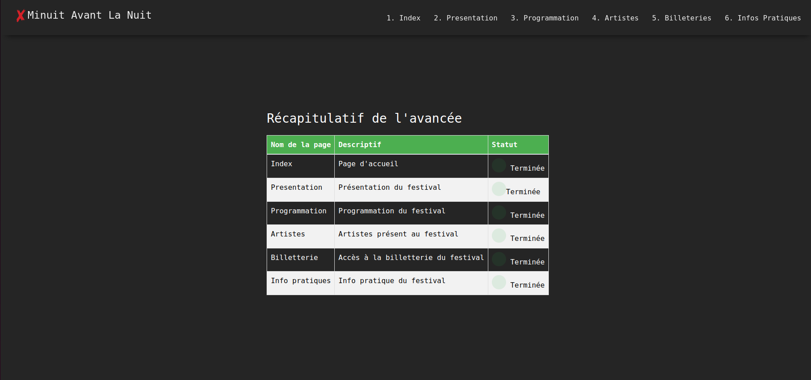

----------------------------------------------------------------------
# MinuitAvantLaNuit[FR]------------------------------------------------------------------------------------------

## Introduction
Ce projet a été réalisé dans le cadre d'un travail pratique sur le HTML et le CSS dans le cadre de ma formation à l'[ESIR]. Il s'agit d'un clone simpliste du site web [MinuitAvantLaNuit.fr](https://minuitavantlanuit.fr/), avec des contraintes spécifiques pour chaque page, conformément aux instructions du TP/TD IHM - HTML et CSS.

## Récapitulatif des Pages Imposées

### 1. Page d'accueil (index.html)
- Structure de base avec entête, navigation, contenu de la page et pied de page.
- Tableau récapitulatif de l'avancement du projet.
- Utilisation de Bootstrap pour l'aspect visuel.

### 2. Présentation du festival (presentation.html)
- Intégration de l'entête, de la navigation et du pied de page.
- Description du festival avec une image représentative.
- Carrousel Bootstrap avec les images d'artistes.

### 3. Programmation du festival (programmation.html)
- Affichage de la programmation par jour.
- Liens d'ancrage vers les jours correspondants.
- Soignée présentation visuelle.

### 4. Page Artiste (artiste.html)
- Présentation d'un groupe de musique participant au festival.
- Image du groupe, texte de présentation, vidéo et membres du groupe.
- Possibilité de réutiliser la même structure pour d'autres artistes.

### 5. Billetterie (billetterie.html)
- Formulaire de réservation de billets pour le festival.
- Collecte d'informations utilisateur avec validation côté serveur.
- Options pour les jours réservés, assurances, emplacement de camping et T-shirt du festival.

### 6. Infos pratiques (info.html)
- Informations pratiques pour les participants au festival.
- Carte Google Maps pour localiser l'événement.
- Liens vers les transports, institutions locales et hébergements.

## Ressources supplémentaires
En plus des ressources fournies dans le cadre du cours, j'ai utilisé les sites suivants :
- Documentation HTML et CSS de Mozilla Developer Network (MDN)
- Documentation et guides de W3Schools
- Documentation Bootstrap
  
## Liberté prise
- Quand l'on clique sur un artiste de la programmation.html , cela nous redirige sur sa page d'artiste.html (marche que pour Winnterzuko et Disiz)
- Utilisation JS pour meilleur slide
